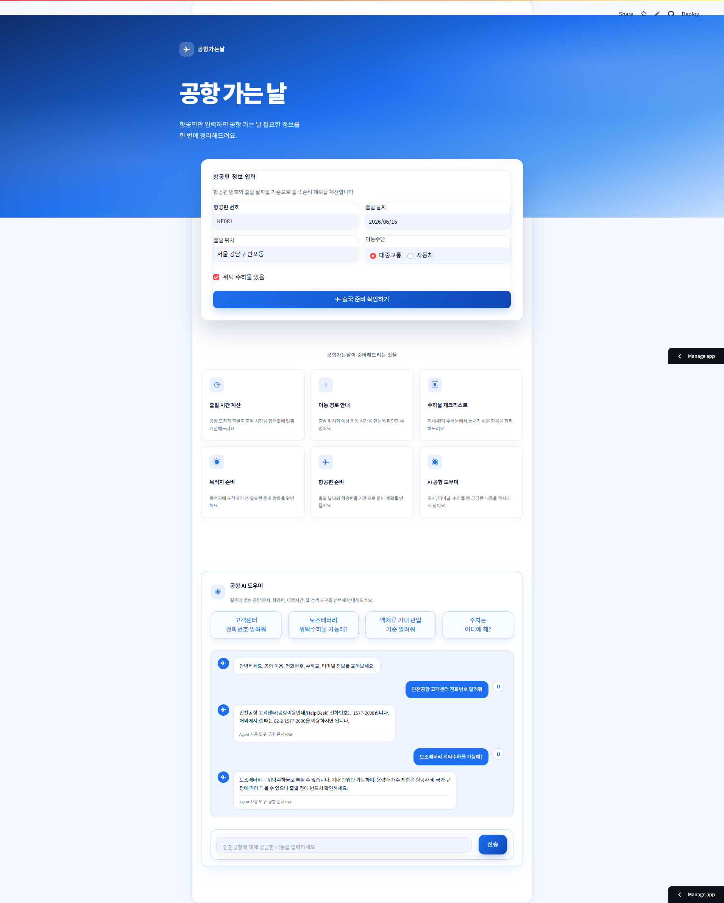
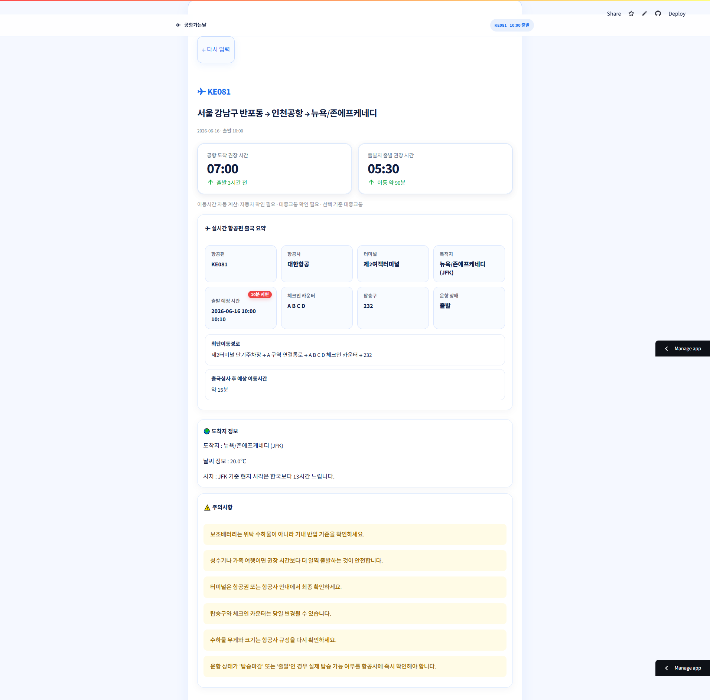
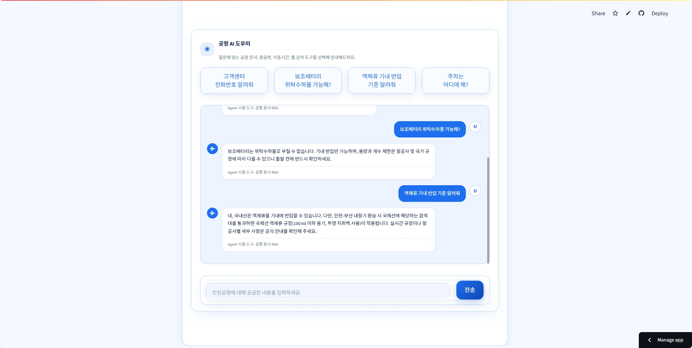
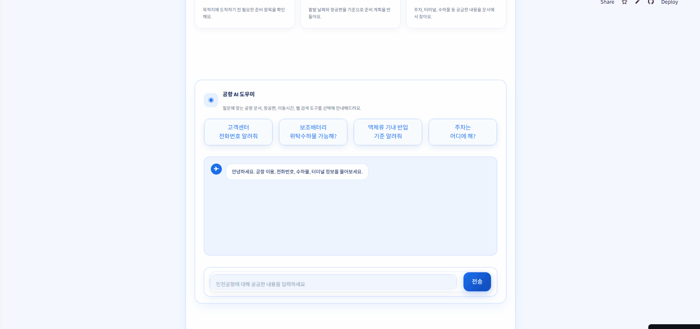

# 공항가는날(Airport AI Assistant) | LangChain 기반 RAG Agent 프로젝트


인천공항 출국 준비를 도와주는 **Agent + RAG + 챗봇 기반 AI Assistant**입니다.

사용자는 항공편 번호, 출발 날짜, 출발 위치를 입력하면 출국 준비 대시보드를 확인할 수 있고, 챗봇을 통해 수하물, 전화번호, 터미널, 주차, 공항 시설 등 인천공항 이용 정보를 질문할 수 있습니다.

<br/>

## 배포 링크

Streamlit Cloud 배포 링크

```text
https://airport-ai-assistant.streamlit.app
```

<br/>

## 프로젝트 개요



공항 출국 준비 과정에서는 항공편 정보, 공항 도착 시간, 이동 시간, 터미널, 체크인 카운터, 수하물 규정, 고객센터 연락처 등 여러 정보를 따로 확인해야 합니다.

본 프로젝트는 이러한 정보를 하나의 서비스에서 확인할 수 있도록 구성했습니다.

핵심 기능은 다음과 같습니다.

* 항공편 번호와 출발 날짜 기반 실시간 출국 정보 조회
* 출발 위치 기준 인천공항까지 이동 시간 계산
* 출국 준비 시간표 및 최단이동경로 제공
* 도착지 날씨 및 시차 정보 제공
* 인천공항 FAQ / 전화번호 / 수하물 / 터미널 등 문서 기반 RAG 검색
* 질문 의도에 따라 적절한 도구를 선택하는 Tool-calling Agent
* 공식 문서에서 근거를 찾기 어려운 경우 공식 웹 검색 fallback 수행
* Streamlit 기반 웹 UI 제공

<br/>

## 주요 기능

### 1. 출국 준비 대시보드



항공편 번호와 출발 날짜를 입력하면 인천공항 출국 정보를 조회합니다.

제공 정보:

* 항공편
* 항공사
* 터미널
* 목적지
* 출발 예정 시간
* 체크인 카운터
* 탑승구
* 운항 상태
* 최단 이동 경로
* 출국심사 후 예상 이동시간

<br/>

### 2. 공항 도착 및 출발 시간 계산

입력한 출발 위치와 이동수단을 기준으로 공항까지의 예상 이동 시간을 계산하고, 국제선 출국 기준으로 공항 도착 권장 시간과 출발지 출발 권장 시간을 제공합니다.

제공 정보:

* 공항 도착 권장 시간
* 출발지 출발 권장 시간
* 자동차 / 대중교통 예상 이동 시간
* 위탁 수하물 여부에 따른 체크리스트

<br/>

### 3. RAG 기반 공항 AI 챗봇



인천국제공항 공식 FAQ와 전화번호 안내 데이터를 RAG 검색용 문서로 구축하고, 사용자 질문과 관련된 문서를 검색해 근거 기반 답변을 생성합니다.

처리 흐름:

```text
사용자 질문
→ 공항 문서 검색
→ 관련 문서 Top-K 추출
→ 질문 + 검색 문서 + 항공편 문맥을 LLM에 전달
→ 답변 생성
→ Markdown 제거 / 출처 문구 정리 / fallback 처리
→ 챗봇 화면 출력
```

<br/>

### 4. Tool-calling Agent 구조



기존의 단순 RAG 챗봇 구조를 확장하여, LangChain 기반 Tool-calling Agent 구조를 적용했습니다.

Agent는 사용자 질문 의도에 따라 아래 도구 중 필요한 도구를 선택합니다.

| Tool                          | 역할                                     |
| ----------------------------- | -------------------------------------- |
| `search_airport_documents`    | FAQ, 전화번호, 수하물, 터미널 등 로컬 공항 문서 검색      |
| `search_official_airport_web` | 매장, 카페, 식당, 운영시간 등 최신성이 필요한 정보 공식 웹 검색 |
| `lookup_departure_flight`     | 항공편 번호와 날짜 기반 실시간 출국 항공편 조회            |
| `lookup_travel_time`          | 출발지에서 인천공항 터미널까지 자동차/대중교통 이동시간 조회      |
| `lookup_destination_info`     | 항공편 목적지 기준 날씨 및 시차 정보 조회               |
| `calculate_airport_plan`      | 항공편·출발지·이동시간 기반 출국 준비 계획 계산            |

<br/>

## 아키텍처

```text
사용자 입력
  ├─ 항공편 번호 / 출발 날짜 / 출발 위치
  │
  ├─ 출국 준비 대시보드
  │   ├─ 인천공항 항공편 API
  │   ├─ Google Maps 이동시간 API
  │   ├─ 도착지 날씨 / 시차 정보
  │   └─ 출국 준비 계획 계산
  │
  └─ 공항 AI 챗봇
      ├─ Tool-calling Agent
      │   ├─ 공항 문서 RAG 검색
      │   ├─ 공식 웹 검색 fallback
      │   ├─ 항공편 조회
      │   ├─ 이동시간 조회
      │   ├─ 도착지 정보 조회
      │   └─ 출국 계획 계산
      │
      └─ LLM 답변 생성
          ├─ 근거 기반 답변
          ├─ 서비스형 말투 정리
          ├─ Markdown 문법 제거
          └─ 출처 / fallback 문구 정리
```

<br/>

## RAG 데이터 구성

인천국제공항 공식 사이트 기반 데이터를 수집하고, RAG 검색에 유리하도록 Markdown 문서로 변환했습니다.

| 문서                    | 설명                  |
| --------------------- | ------------------- |
| `airport_faq.md`      | 인천국제공항 공식 FAQ 기반 문서 |
| `airport_contacts.md` | 인천공항 전화번호 안내 문서     |
| `baggage_rules.md`    | 수하물 관련 규정 문서        |
| `checklist_rules.md`  | 출국 준비 체크리스트 문서      |
| `terminal_info.md`    | 터미널 및 공항 이용 정보 문서   |

RAG 문서는 제목 단위로 chunk 분할 후 BM25 기반 검색에 사용됩니다.

<br/>

## 답변 품질 개선

챗봇 답변이 단순 문서 요약처럼 보이지 않도록 서비스형 답변 후처리를 적용했습니다.

개선 내용:

* `**텍스트**` 형태의 Markdown 강조 문법 제거
* URL 중심의 출처 표현 제거
* 사용자 서비스 화면에 맞는 자연스러운 안내 문구 적용
* 고객센터, 콜센터, Help Desk 등 실제 사용자 질문 표현 보강
* 전화번호 질문은 문서 필드 기반으로 직접 응답
* 근거가 부족한 질문은 억지 답변 대신 fallback 안내 제공

예시:

```text
인천공항 고객센터는 1577-2600으로 문의하시면 됩니다.

- 해외에서 이용할 때는 +82-2-1577-2600으로 연락할 수 있어요.
- 상담 가능 시간은 07:00~22:00입니다.

※ 인천국제공항 공식 안내 기준으로 답변드렸어요.
```

<br/>

## 기술 스택

| 구분             | 기술                            |
| -------------- | ----------------------------- |
| Frontend / App | Streamlit                     |
| LLM            | Upstage Solar                 |
| Agent          | LangChain Tool-calling Agent  |
| RAG            | LangChain, BM25Retriever      |
| Search         | rank-bm25, ddgs               |
| API            | 인천공항 항공편 API, Google Maps API |
| Data Format    | Markdown                      |
| Config         | `.env`, Streamlit Secrets     |
| Deploy         | Streamlit Community Cloud     |

<br/>

## 폴더 구조

```text
airport-ai-assistant/
├── .devcontainer/                  # 개발 컨테이너 설정 폴더
│   └── devcontainer.json           # VS Code Dev Container 환경 설정
│
├── .github/                        # GitHub 협업 설정 폴더
│   ├── ISSUE_TEMPLATE/             # 이슈 템플릿 폴더
│   └── pull_request_template.md    # Pull Request 작성 템플릿
|
├── assets/
|   ├── demo.gif                    # 전체 서비스 사용 흐름 GIF
|   ├── main_page.png               # 메인 항공편 입력 화면
|   ├── dashboard.png               # 출국 준비 대시보드 화면
|   ├── chatbot.png                 # 공항 AI 챗봇 화면
|   └── agent_tools.png             # Agent 사용 흐름 GIF
│
├── data/                           # RAG 검색용 공항 문서 폴더
│   ├── airport_contacts.md         # 인천공항 전화번호 안내 RAG 문서
│   ├── airport_faq.md              # 인천공항 FAQ RAG 문서
│   ├── baggage_rules.md            # 수하물 규정 관련 문서
│   ├── checklist_rules.md          # 출국 준비 체크리스트 문서
│   └── terminal_info.md            # 터미널 및 공항 이용 정보 문서
│
├── evals/                          # 챗봇 테스트 질문 및 평가용 자료 폴더
│   └── test_questions.md           # 기능 점검용 테스트 질문 목록
│
├── src/                            # 서비스 핵심 로직 폴더
│   ├── __init__.py                 # src 패키지 인식용 파일
│   ├── agent.py                    # LangChain Tool-calling Agent 구성 및 도구 등록
│   ├── destination_info.py         # 도착지 날씨 정보 조회 및 요약
│   ├── flight_api.py               # 인천공항 출국 항공편 API 조회
│   ├── flight_summary.py           # 항공편 정보 카드 및 이동 경로 요약 생성
│   ├── planner.py                  # 공항 도착 시간, 출발 시간, 체크리스트 계산
│   ├── rag.py                      # 공항 문서 로딩, BM25 검색, RAG 답변 생성
│   ├── schemas.py                  # Pydantic 데이터 모델 정의
│   ├── timezone_info.py            # 도착지 시차 정보 계산
│   ├── travel_time_api.py          # Google Maps 기반 이동시간 조회
│   └── web_search_fallback.py      # 공식 웹 검색 fallback 로직
│
├── .env.example                    # 환경변수 예시 파일
├── .gitignore                      # Git 제외 파일 설정
├── LICENSE                         # 라이선스
├── app.py                          # Streamlit 메인 실행 파일
└── requirements.txt                # Python 패키지 의존성 목록
```

<br/>

## 실행 방법

### 1. 저장소 clone

```bash
git clone https://github.com/사용자명/레포명.git
cd 레포명
```

<br/>

### 2. 가상환경 생성 및 활성화

```bash
python -m venv .venv
```

Windows:

```bash
.venv\Scripts\activate
```

macOS / Linux:

```bash
source .venv/bin/activate
```

<br/>

### 3. 패키지 설치

```bash
pip install -r requirements.txt
```

<br/>

### 4. 환경변수 설정

`.env.example` 파일을 참고해 `.env` 파일을 생성합니다.

```env
UPSTAGE_API_KEY=your_upstage_api_key
SOLAR_MODEL=solar-pro3

ICN_API_SERVICE_KEY=your_incheon_airport_api_key
GOOGLE_MAPS_API_KEY=your_google_maps_api_key
```

`.env` 파일은 API 키가 포함되므로 GitHub에 업로드하지 않습니다.

<br/>

### 5. 앱 실행

```bash
streamlit run app.py
```

<br/>

## 테스트 질문 예시

챗봇 기능 점검 시 아래 질문을 사용할 수 있습니다.

```text
인천공항 고객센터 전화번호 알려줘
보조배터리 위탁수하물 가능해?
액체류 기내 반입 기준 알려줘
인천공항 주차는 어디에 해?
제1터미널에 식당 있어?
항공편 KE713 출발 정보 알려줘
공항까지 몇 시에 출발해야 해?
도착지 날씨 알려줘
```

<br/>

## 주요 구현 내용

### 공항 문서 RAG

* 인천공항 공식 FAQ와 전화번호 안내 데이터를 Markdown 문서로 구축
* 문서를 제목 단위 chunk로 분할
* BM25 기반으로 관련 문서 Top-K 검색
* 검색 문서를 LLM에 전달해 근거 기반 답변 생성

<br/>

### 전화번호 질문 직접 응답

전화번호 관련 질문은 LLM이 숫자를 임의 생성하지 않도록 문서 필드에서 전화번호, 위치, 운영시간을 직접 추출해 답변합니다.

예시 질문:

```text
인천공항 고객센터 전화번호 알려줘
인천공항 콜센터 번호 알려줘
유실물관리소 연락처 알려줘
```

<br/>

### Agent 도구 선택

사용자 질문에 따라 Agent가 필요한 도구를 선택합니다.

예시:

```text
"보조배터리 위탁수하물 가능해?"
→ search_airport_documents

"제1터미널에 카페 있어?"
→ search_official_airport_web

"TR843 출발 정보 알려줘"
→ lookup_departure_flight

"서울 강남구에서 공항까지 얼마나 걸려?"
→ lookup_travel_time

"도착지 날씨 알려줘"
→ lookup_destination_info
```

<br/>

### UI 개선

* 공항 서비스에 맞는 카드형 UI 구성
* 빠른 질문 버튼 제공
* 챗봇 메시지 말풍선 UI 적용
* 항공편 요약 카드 구성
* 주의사항 카드 구성
* Streamlit 기본 UI 요소를 CSS로 보정

<br/>

## 협업 및 역할

본 프로젝트는 Upstage X Fastcampus AI LAB LLM 애플리케이션 개발 프로젝트로 진행되었습니다.

주요 협업 내용:

* 항공편 API 조회 기능 구현
* 이동시간 계산 기능 구현
* 도착지 날씨 및 시차 정보 구현
* 인천공항 FAQ / 전화번호 문서 수집 및 RAG 문서화
* RAG 검색 품질 개선
* Tool-calling Agent 구조 적용
* Streamlit UI 구현 및 디자인 개선
* Streamlit Cloud 배포

<br/>

## 주의사항

* 본 서비스의 정보는 참고용입니다.
* 실제 출국 전에는 항공사 및 인천국제공항 공식 안내를 반드시 확인해야 합니다.
* 항공편 상태, 탑승구, 체크인 카운터, 운영시간 등은 당일 변경될 수 있습니다.
* API 키가 필요한 기능은 키가 없거나 할당량이 초과되면 정상 동작하지 않을 수 있습니다.

<br/>

## 향후 개선 방향

* 모바일 어플 확장 및 연동 & 배포
* 공항 관련 기능 추가 및 업그레이드
* 인천공항 -> 다양한 공항으로 확장
* 항공편 지연/탑승마감 상태에 따른 경고 로직 강화
* 공항 시설 검색 결과의 터미널별 정렬 개선
* Agent 사용 도구 표시 방식 개선
* 대화 히스토리 기반 멀티턴 응답 품질 개선
* Docker 기반 배포 환경 구성
* 테스트 질문 세트 기반 자동 평가 추가

<br/>

## License

이 프로젝트는 학습 및 포트폴리오 목적으로 제작되었습니다.
라이선스 세부 내용은 `LICENSE` 파일을 참고하세요.
